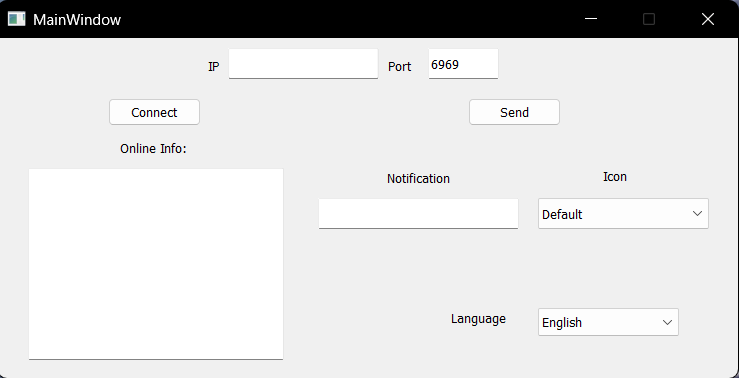

# Fika Server Tool

## Introduction
Welcome to Fika Server Tool, a practical tool designed for posting notifications and retrieving information from the SPT Fika server. Developed as a Qt practice project, it showcases basic functionalities with a user-friendly interface.

  

## Build Environment
- **Qt Version**: 5.14.2
- **Compiler**: MinGW 7.3.0 64-bit

## Release
**Coming Soon!** Stay tuned for updates, and you'll be able to download the tool from our [Releases Page](https://github.com/RoyZ-iwnl/Fika-Server-Tool/releases).
